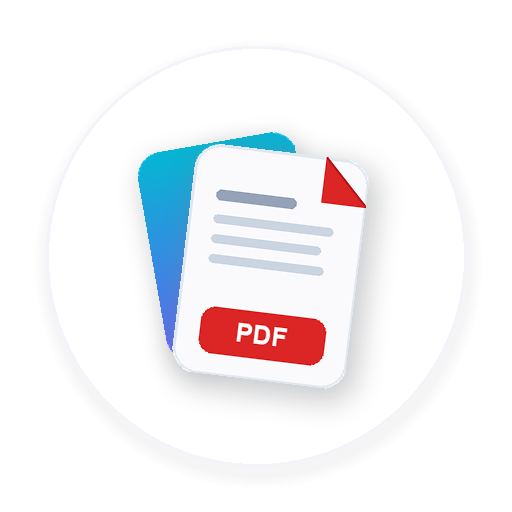

#  Image to PDF (Android)

[](https://kotlinlang.org/)
[-3DDC84.svg?logo=android&logoColor=white)](https://developer.android.com)
[-blue.svg)](https://developer.android.com)
[](https://developer.android.com/jetpack/compose)
[-059669.svg)](#-privacy--security-first)
[](LICENSE)

A modern, high-performance, **100% offline and privacy-first** Android application built with **Jetpack Compose** and **Material 3**. Convert single or multi-page photos into crisp, crystal-clear PDF documents directly on your device with no backend servers, zero telemetry, and zero network calls.

---

## ✨ Features

### 📸 Seamless Image Ingestion
- **Photo Picker Integration**: Uses Android's modern, privacy-friendly system PhotoPicker for multi-image selection without requiring broad storage permissions.
- **In-App Camera Capture**: Instant document photography via camera launch with secure scoped `FileProvider` storage.
- **Batch Processing**: Select dozens of images at once and arrange them into a structured document effortlessly.

### 💎 Lossless Rendering & Quality Control
- **Zero Lossy Downscaling**: Preserves full original sensor resolution and clarity.
- **Compression Presets**:
  - **Ultra HD • Original (100%)**: Original camera sensor output with maximum visual fidelity for legal, financial, and textual documents.
  - **Balanced • Sharp (85%)**: High-resolution output optimized for everyday sharing and email attachments.
  - **Compact • Web Ready (65%)**: Reduced size footprint for bandwidth-restricted transfers.
- **Live File Size Estimator**: Real-time calculated PDF size prediction before compiling.

### 🎨 Document Filters & Image Tuning
- **Filter Presets**:
  - **Original**: Natural vibrant colors.
  - **B&W Clean**: High-contrast document binarization tailored for text legibility, receipts, and scans.
  - **Grayscale**: Smooth studio monochrome.
  - **Magic Color**: Contrast boost and shadow brightening.
  - **Sepia**: Warm vintage document tone.
- **Pan, Zoom & Crop**: Pinch to zoom up to 300%, interactive panning offsets, and fit-to-page vs. fill-to-page toggle.
- **Rotation**: Lossless 90° rotation per page or batch-applied across all selected pages.
- **Page Duplication**: One-tap cloning of any page with all applied filters, orientations, and crops preserved.

### 📐 Layout & PDF Architecture
- **Standard Page Sizes**: Supports **A4 (210 × 297 mm)**, **US Letter (8.5 × 11 in)**, and **Fit to Image (Exact Dimensions)**.
- **Orientation Modes**:
  - **Portrait**: Unified vertical page layout.
  - **Landscape**: Unified horizontal page layout.
  - **Auto**: Matches each page's orientation to individual image aspect ratios.
- **Adjustable Margins**: None (0 mm), Compact (6 mm), or Standard (12 mm).
- **Page Numbering**: Crisp, professional "Page X of Y" footer numbering on every page.

### 🛡️ Custom Watermark & Security Stamp
- **Preset Stamp Library**: `CONFIDENTIAL`, `DRAFT`, `ORIGINAL`, `PAID`, `SAMPLE`, or custom text.
- **Angle Alignment**: Diagonal (45°) or Horizontal (0°).
- **Styling**: Classic Gray, Stamp Red, or Security Blue with customizable opacity (10%–60%) and font scale.
- Native Android `Canvas` rendering directly on top of images without degrading photo sharpness.

### 🔄 Multi-Select Batch Actions & Reordering
- **Contextual Selection Bar**: Select any page to trigger batch actions: **Select All**, **Batch Rotate (90°)**, and **Batch Delete**.
- **Visual Reorder Screen**: Quick arrow-key shifting or interactive drag-and-drop to position pages in the exact sequence desired.

### 🌓 Dark / Light Theme & Smooth Motion
- **Dual Material 3 Schemes**:
  - **Light Mode**: Crisp slate `#F8FAFC` background with pure white cards and Electric Indigo / Cyan accents.
  - **Dark Mode**: Deep midnight OLED `#0B0F19` backdrop with rich Slate-800 `#1E293B` cards.
- **1-Tap Quick Toggle**: Animated sun-to-moon rotation and crossfade physics in the top bar.
- **Theme Selection Menu**: Long-press options for **Light Mode**, **Dark Mode**, and **System Default**, persisted across app restarts via `SharedPreferences`.
- **Fluid Screen Transitions**: Powered by Compose `AnimatedContent` for sliding, zoom, and sheet transitions between Splash, Home, History, and Reorder screens.
- **Item Animations**: Animated grid reordering and insertions using `Modifier.animateItem()`.

### 📂 History, Export & Native Printing
- **Direct Save to Downloads**: Saves generated PDFs to `/sdcard/Download/ImageToPDF/` via scoped `MediaStore.Downloads`.
- **Native Android Printing**: Built-in `PrintManager` and `PrintDocumentAdapter` to print directly to physical printers or PDF virtual printers.
- **Document History**: Offline registry of generated PDFs with real-time text search, sorting chips (Newest, Oldest, Largest, Smallest), and one-tap open/share/print/delete actions.

---

## 🔒 Privacy & Security First

This application is engineered with an uncompromising privacy architecture:
- **No Internet Access**: The `android.permission.INTERNET` permission is **not declared** in the manifest. The application cannot communicate with external servers even if it wanted to.
- **100% On-Device Processing**: All filtering, rotation, PDF generation, and watermarking happen strictly within the local memory of your Android device.
- **No Analytics / Telemetry**: Zero SDKs for tracking, advertising, crash reporting, or user monitoring.
- **Scoped Storage**: Utilizes Android's modern scoped storage and `MediaStore` APIs—no broad external storage read/write permissions required on Android 10+.

---

## 🛠️ Architecture & Tech Stack

```
com.example.imagetopdf
├── data/
│   ├── HistoryPreferences.kt      # SharedPreferences persistence for PDF history records
│   └── ThemePreferences.kt        # Local storage for ThemeMode (Light, Dark, System)
├── engine/
│   └── PdfGeneratorEngine.kt      # High-performance native PdfDocument generation engine
├── model/
│   └── Models.kt                  # Domain data classes, Enums (FilterType, PageSize, Watermark, etc.)
├── theme/
│   ├── Color.kt                   # Semantic tokens for Light & OLED Dark palettes
│   ├── Theme.kt                   # Material 3 Theme wrapper with ThemeMode observer
│   └── Type.kt                    # Typography definitions
├── ui/
│   ├── ImageToPdfApp.kt           # Root navigation host with AnimatedContent transitions
│   ├── components/
│   │   ├── Dialogs.kt             # Success, deletion confirmation, and loading dialogs
│   │   ├── FilterSheet.kt         # Bottom sheet for page adjustments & filter previews
│   │   └── PdfConfigDialog.kt     # Configuration dialog (watermarks, quality, sizing)
│   └── screens/
│       ├── HomeScreen.kt          # Staging grid, contextual batch bar, top action bar
│       ├── HistoryScreen.kt       # Searchable document history list with sorting
│       ├── PreviewScreen.kt       # Full-screen single page inspection & zoom
│       ├── ReorderScreen.kt       # Page reordering & rearrangement canvas
│       └── SplashScreen.kt        # Animated branded intro with laser scan effect
└── viewmodel/
    └── MainViewModel.kt           # Central state manager (StateFlow / SharedFlow)
```

### Key Libraries & Tools
- **Language**: Kotlin 2.0+ with JVM toolchain 17
- **UI Framework**: Android Jetpack Compose with Material 3 (Compose BOM 2026.03.01)
- **Image Loading**: Coil Compose (`io.coil-kt:coil-compose`)
- **Graphics & PDF**: Android Native `android.graphics.pdf.PdfDocument`, `android.graphics.Canvas`, `android.graphics.ColorMatrixColorFilter`
- **State Management**: Android Architecture Components (`ViewModel`, `StateFlow`, `asStateWithLifecycle`)
- **Persistence**: Scoped `SharedPreferences` with Kotlin Serialization / JSON
- **Printing**: Android Native `android.print.PrintManager`

---

## 🚀 Building & Releasing

This guide covers compiling both the **debug** and **release** APKs from source, setting up a proper release signing keystore, running tests, and troubleshooting.

> **Tip:** On Windows use `.\gradlew.bat`, on macOS/Linux use `./gradlew`. All paths below are relative to the project root.

### Prerequisites

| Requirement | Version / Note |
|---|---|
| **JDK** | Java Development Kit **17** (`JAVA_HOME` set, `java -version` shows 17) |
| **Android SDK** | Platform **API 36** + **Build Tools 36** (via Android Studio SDK Manager) |
| **Android Studio** | Ladybug / Meerkat or newer (optional — CLI-only builds work too) |
| **SDK path** | Auto-detected by Android Studio, or set `sdk.dir=...` in `local.properties` |

### 1. Debug APK (fast, unsigned-with-debug-key, **not** size-optimized)

1. **Clone** the repository and open a terminal in the project root.
2. **Build the debug APK**:
   ```bash
   ./gradlew assembleDebug        # macOS / Linux
   .\gradlew.bat assembleDebug    # Windows
   ```
3. **Output**: `app/build/outputs/apk/debug/app-debug.apk` (~20 MB — includes Compose tooling, no R8 shrinking).
4. **Install directly on a connected device / emulator**:
   ```bash
   ./gradlew installDebug
   ```
   or `adb install -r app/build/outputs/apk/debug/app-debug.apk`.

### 2. Release APK (R8-minified, resource-shrunk, for store/private distribution)

1. **Build the release APK**:
   ```bash
   ./gradlew assembleRelease       # macOS / Linux
   .\gradlew.bat assembleRelease   # Windows
   ```
2. **Output**: `app/build/outputs/apk/release/app-release.apk` (~4 MB — R8 minify + resource shrink enabled).
3. **Important — signing**: the project currently signs the release build with the **debug keystore** (see `app/build.gradle.kts`) so you can test a fully-optimized build immediately. **Do not upload a debug-signed APK to Google Play.** For distribution, configure a real keystore (next section).

> For the **Google Play** format, build an App Bundle instead: `./gradlew bundleRelease` → `app/build/outputs/bundle/release/app-release.aab`.

### 3. Configure a Production Signing Keystore

```bash
# 1. Generate a keystore (fill in the prompts)
keytool -genkey -v -keystore release.jks -keyalg RSA -keysize 2048 -validity 10000 -alias imagetopdf
```

```properties
# 2. Create keystore.properties in the project root (gitignored — never commit it)
storeFile=release.jks
storePassword=CHANGE_ME
keyAlias=imagetopdf
keyPassword=CHANGE_ME
```

```kotlin
// 3. Add to app/build.gradle.kts (after the existing signingConfigs debug block)
val keystoreProps = Properties().apply {
    val f = rootProject.file("keystore.properties")
    if (f.exists()) f.inputStream().use { load(it) }
}

android {
    signingConfigs {
        create("release") {
            if (keystoreProps.isNotEmpty()) {
                storeFile = rootProject.file(keystoreProps.getProperty("storeFile"))
                storePassword = keystoreProps.getProperty("storePassword")
                keyAlias = keystoreProps.getProperty("keyAlias")
                keyPassword = keystoreProps.getProperty("keyPassword")
            }
        }
    }
    buildTypes {
        release {
            signingConfig = signingConfigs.getByName(
                if (keystoreProps.isNotEmpty()) "release" else "debug"
            )
        }
    }
}
```

Then re-run `./gradlew assembleRelease` — the APK is now signed with your production key.

### 4. Tests & Verification

| Command | What it does |
|---|---|
| `./gradlew testDebugUnitTest` | Runs all unit tests (currently **28** — model, logic & PDF-math regression suites) |
| `./gradlew lintDebug` | Android Lint static analysis (report: `app/build/reports/lint-results-debug.html`) |
| `./gradlew clean assembleDebug assembleRelease testDebugUnitTest lintDebug` | One-shot full verification |

### 5. Troubleshooting

| Problem | Fix |
|---|---|
| `JAVA_HOME is not set` / "Unable to locate a Java Runtime" | Install JDK 17 and set `JAVA_HOME`; ensure `java -version` reports 17 |
| "Failed to find target with hash string 'android-36'" | Open SDK Manager in Android Studio, install API 36 platform + Build Tools |
| "SDK location not found" | Create `local.properties` with `sdk.dir=C\:\\Users\\<you>\\AppData\\Local\\Android\\Sdk` |
| `OutOfMemoryError` during Gradle build | Add `org.gradle.jvmargs=-Xmx2048m` to `gradle.properties` (already tuned for this project) |
| Release APK marked "debug-signed" | You ran `assembleRelease` with the default debug signing — follow §3 to configure your keystore |
| Huge debug APK size | Expected — debug builds skip R8/shrinking; use the release APK for distribution |

---

## 📖 Usage Guide

1. **Add Images**: Tap **Camera** to capture a fresh document page or **Gallery** to select one or multiple images via the photo picker.
2. **Fine-Tune Pages**:
   - Tap any card to rotate (90°), duplicate, or delete.
   - Long-press or tap **Edit** to enter the filter bottom sheet: adjust contrast, apply B&W Clean or Magic Color, and pinch to zoom/pan.
   - Tap **Reorder** in the bottom bar to adjust page order.
3. **Configure & Export**:
   - Tap **Convert to PDF** in the top bar.
   - Choose your output filename, page format (**A4**, **Letter**, **Fit to Image**), orientation (**Portrait**, **Landscape**, **Auto**), and margin size.
   - *(Optional)* Enable **Watermark**: Choose a preset like `CONFIDENTIAL` or type custom text, select diagonal or horizontal, and pick a color/opacity.
   - Tap **Generate PDF**.
4. **Share, Print & Save**:
   - The success dialog provides instant buttons to **Open**, **Save to Downloads**, **Print**, or **Share** the generated document.
   - Access previously generated documents anytime via the **History** button in the top bar.

---

## 📄 License

```
Copyright 2026 Image to PDF Contributors

Licensed under the Apache License, Version 2.0 (the "License");
you may not use this file except in compliance with the License.
You may obtain a copy of the License at

    http://www.apache.org/licenses/LICENSE-2.0

Unless required by applicable law or agreed to in writing, software
distributed under the License is distributed on an "AS IS" BASIS,
WITHOUT WARRANTIES OR CONDITIONS OF ANY KIND, either express or implied.
See the License for the specific language governing permissions and
limitations under the License.
```
